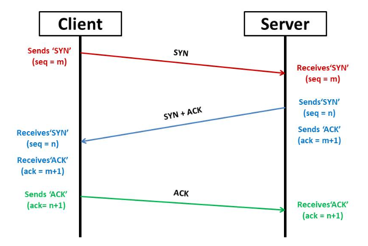

# 📘 Syn Lab

This lab is for educational purposes only. It simulates TCP SYN-flood attack.
Start the lab with Docker: an Nginx server runs in a container and listens on port 80.
Use the provided python function to send TCP SYN packets to the target IP:

**Notes & safety:**
- Use this lab only in an isolated environment (e.g., a Docker network or local VM).
- Do not send traffic to public IPs or third-party infrastructure.
- Running packet-generation scripts usually requires root/administrator privileges.
- Consider capturing traffic with `tcpdump` or `Wireshark` and saving PCAPs for analysis.

---

## 🧠 Background

A successful TCP connection is the result of three specific packets which exchanged between the client and server. (3-Way-Handshake)

1) The client wants to establish a TCP connection. Therefore, it sends a packet with the `SYN` flag set.
2) The server receives and acknowledges the packet by sending a response with both the `SYN` and `ACK` flags set
3) The client receives the packet sent by the server and acknowledges it too with an `ACK` flag set.

=> After these three steps, a TCP connection is successfully established.

A SYN-flood attack exploits the TCP handshake. Instead of completing the handshake, the attacker keeps sending large numbers of SYN packets. 
These create many half-open connections: the server allocates state for each SYN and waits for the final ACK , tying up resources and eventually exhausting the server's connection backlog.




---

## ⚙️ Prerequisites & Installation

### Prerequisites
- [x] scapy


### Installation

First create a virtual environment


```
python3 -m venv venv  #create venv 
source venv/bin/activate # activate it
pip install scapy # install scappy
```


## 🚀 Nutzung
```
docker compose up --build #start docker container
python attacker/load_test.py --target localhost --port 8080 #start the syn flood 
```

## Learnings